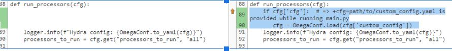
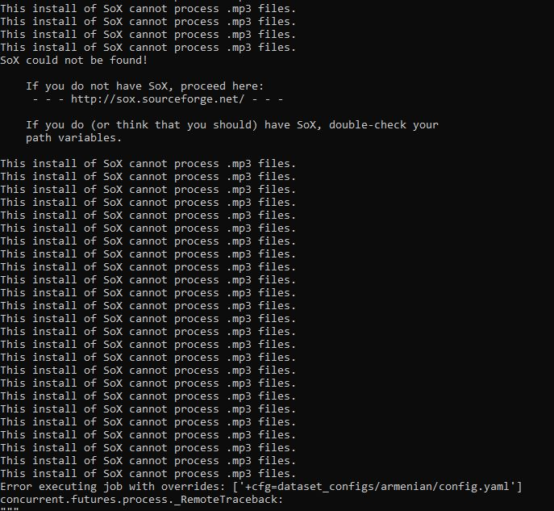
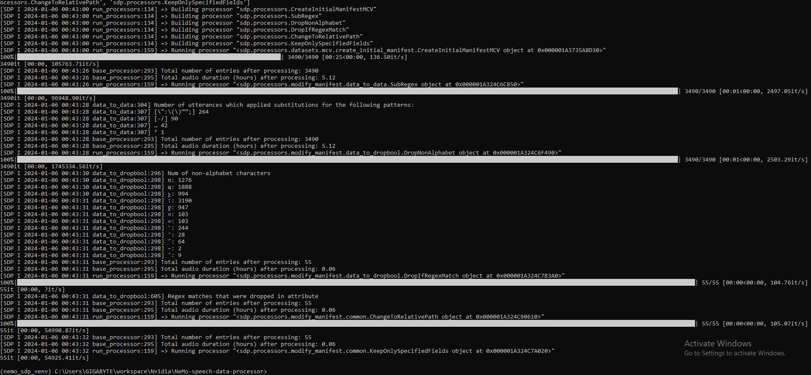

## General Info
- **OS**: Windows 10
- **GPU**: RTX 3090-Ti
- **CUDA Version**: 12.2

## Environment Installation

#### <font color='red'>Problem</font> - Difficult to install Hydra-core/editdistance in Conda (using pip or conda-forge).

#### <font color='lightgreen'>Solution</font>- Switch to Python virtual environment (`venv`) with `python>=3.10`

## Running the Project

#### <font color='red'>Problem</font> -  Lack of documentation on running `main.py` and passing `config.yaml`

#### <font color='lightgreen'>Solution:</font>

a) Place the right paths in hydra decorator in the `main.py` (practical to set in the code when working on the project long-term)

```python
@hydra.main(version_base=None, config_path='dataset_configs/armenian', config_name='mcv.yaml')
def main(cfg):
    run_processors(cfg)
```
b) Provide config path through overwriting the hydra args and loading the config from the given path on CLI through changing the source code


1. Change source code: `sdp/run_processors.py` line 89


2. Execute the script with the following command, specifying the path to your custom configuration file:

    ```bash
    python main.py +cfg=path/to/custom_config.yaml
    ```

## Finding Corrupted Files within the Corpus
Use the following method to identify corrupted audio files in the dataset:

- Try reading each audio file using `soundfile.SoundFile(path)` and catch exceptions (`ValueError`, `KeyError`).
- Store the problematic files in a list or other iterable
- Print the list elements through loop, copy, then update `config.yaml` under **sdp.processors.SubRegex** with this information.

## Sox - Sound Processing Issues and Solutions

#### <font color='red'>Problem1</font> - Unrecognized Command


#### <font color='lightgreen'>Solution1:</font>

1. Download and install [SoX](https://sourceforge.net/projects/sox/)
2. Locate the <font color='yellow'> installation path </font>, e.g. `C:\Program Files (x86)\sox-14-4-2`.
3. Add the SoX path to your system's environment variables:
   - Right-click on “This PC” or “My Computer” > Advanced System Settings > Environmental Variables.
   - Edit the “Path” variable and <font color='yellow'> add the SoX installation path </font>
4. Reinstall SoX in your Python environment:
   ```bash
   pip install sox --force-reinstall
    ``` 
5. Open new terminal, reactivate the venv, and retry

#### <font color='red'>Problem2</font>  - ``sox FAIL util: Unable to load MAD decoder library (libmad).``
#### <font color='lightgreen'>Solution2:</font>

1. Download and install [SoX-libmad](https://www.videohelp.com/software?d=sox-14.4.0-libmad-libmp3lame.zip)
2. Manually locate (with admin permissions) to the same folder where <font color='yellow'> Sox is stored </font> e.g. `C:\Program Files (x86)\sox-14.4.0-libmad-libmp3lame`
3. Copy the `libmad.dll` file from  `...\sox-14.4.0-libmad-libmp3lame` to `...\sox-14-4-2`
4. Open new terminal, reactivate the venv, and retry

## Configure sdp.processors.DropNonAlphabet

#### <font color='red'>Problem</font> - new language => new punctuation
#### <font color='lightgreen'>Solution</font> - run `main.py` to extract the punctuations according to which the processor filtered the texts


<div align="center" style="background-color: green; color: black; padding: 0.01px;">
  <p><u><b>Here on the middle section can notice the filtering from 5.12hours to 0.06</b></u></p>
</div>